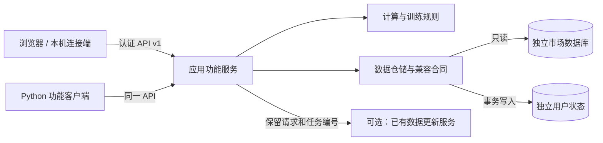

# 听风观澜

市场总览、板块、ETF、题材、异动与龙头、K 线训练。界面、功能和数据各自维护；程序不附带真实行情、用户记录或采集凭据。

2.1将行业相关五库收敛为事实、题材、发布三个职责，取消旧结果后备读取；ETF映射采用自有30行业规则。四指数由数据宿主通过AXDATA与个股同任务采集。升级配置、单位和待确认边界见[数据库整合与指数采集](docs/数据库整合与指数采集.md)。

2.2增加统一目录合同：13项业务存储归入行情、行业、技术知行、用户状态四组；支持合并后的标签/策略库与证券状态/限价库，保留历史引用与独立用户状态。配置方式见[数据系统归集](docs/数据系统归集.md)。

2.3增加统一设置菜单：显示、看图、数据引用与配置管理。设置写入JSON文件，重启后恢复；数据引用检查后保存，重启生效。使用方法见[设置与配置文件](docs/settings.md)。



需要 Python 3.12 或更新版本。本次在 Windows、Python 3.14 上实测；Web 服务和浏览器客户端采用跨平台实现，其他系统的验收范围见审计记录。Windows 桌面能力按平台使用。此版本沿用现有 SQLite 数据合同，远程访问通过业务 API，不直接共享 SQLite 文件，也不提供 PostgreSQL/MySQL 驱动。

## 安装与体验

下载仓库后，在仓库目录执行：

```sh
python -m venv .venv
# Windows PowerShell
.\.venv\Scripts\Activate.ps1
# Linux/macOS 则执行：source .venv/bin/activate
python -m pip install .
guanlan demo ../guanlan-demo
guanlan doctor --config ../guanlan-demo/guanlan.json
guanlan serve --config ../guanlan-demo/guanlan.json --open
```

默认地址为 `http://127.0.0.1:18738/home/`。`demo` 只接受不存在的新目录，生成少量合成股票和交易日，供训练、连接和页面操作验证。它不读取真实数据库；ETF、行业和题材初始结果为空，不填造行情或分类。

## 连接自己的数据库

```sh
guanlan init ../guanlan-local/guanlan.json
```

编辑配置中的 `paths`，运行 `doctor`，再启动服务。所有相对路径相对于配置文件；换安装目录或电脑不用修改代码。市场源只读，训练与题材记录写入 `state_root`。目录布局、字段、日期和单位见 [数据库标准](docs/databases.md)。已有用户状态接入与新状态创建必须明确选择，不能拿演示目录覆盖原记录。

## 在另一台电脑使用

最省配置的方式是让数据所在电脑运行服务，其他电脑用浏览器打开配置的 HTTPS 服务地址并输入令牌。也可以用 SSH 隧道将服务安全映射到本机：

```sh
ssh -N -L 18738:127.0.0.1:18738 user@data-host
```

然后浏览器打开本机 18738 端口。若要在客户端电脑安装独立界面入口：

```powershell
$env:GUANLAN_ACCESS_TOKEN = '<服务管理员给出的令牌>'
guanlan connect --url http://127.0.0.1:18738 --port 18739 --open
```

客户端界面使用本机 18739 端口，查询、训练保存和更新请求仍由数据宿主执行。客户端不需要数据库文件；Python 功能客户端也使用同一接口，见 [部署与连接](docs/deployment.md) 和 [API](docs/api.md)。

## 日常使用

- **市场总览**：查看各类市场概况和数据日期；缺失或过期状态会单独显示。
- **板块 / ETF**：选择目录项，看日线或周线、成分与指标，打开 K 线详情。
- **题材**：编辑、预览、保存、归档或恢复个人题材；应用和重算需要连接数据更新提供者。
- **异动 / 龙头**：选择行情日，查看涨跌异动与评分、打开对应股票图表。
- **K 线训练**：创建 60 或 150 日训练，逐步买入、卖出、持有，查看记录和复盘；进度在服务端独立保存。
- **设置**：右上角打开显示、看图、数据引用和配置管理；共用设置自动保存成文件，可导入导出。窗口关闭不会删除服务端训练记录。

数据更新属于可配置的外部能力，程序启动和浏览不会自动采集。未配置提供者时，更新操作会明确提示“未连接”，查询及训练仍可使用。[完整功能与依赖](docs/features.md) 列出每项的准备条件。

## 代码与验证

| 目录 | 职责 |
|---|---|
| `src/guanlan_ui` | 六栏目页面、样式、图表、设置与浏览器传输；不直接打开数据库 |
| `src/guanlan_app` | API、认证、客户端、功能分派、训练流程、更新适配 |
| `src/guanlan_domain` | 纯计算、指标、训练与涨跌停规则；无数据库和界面依赖 |
| `src/guanlan_data` | 配置、只读策略、数据库合同、仓储、命名训练语句 |
| `tests` | 合成数据回归、边界、认证和远程接口检查 |

```sh
python -m pip install '.[test]'
python -m pytest -q
```

可选的 `.[analysis]` 提供分析缓存依赖；常规浏览和训练不要求它。发布前运行 [公开内容检查](tools/check_public.py)。当前测试范围与实际限制见 [审计记录](docs/audit.md)。
